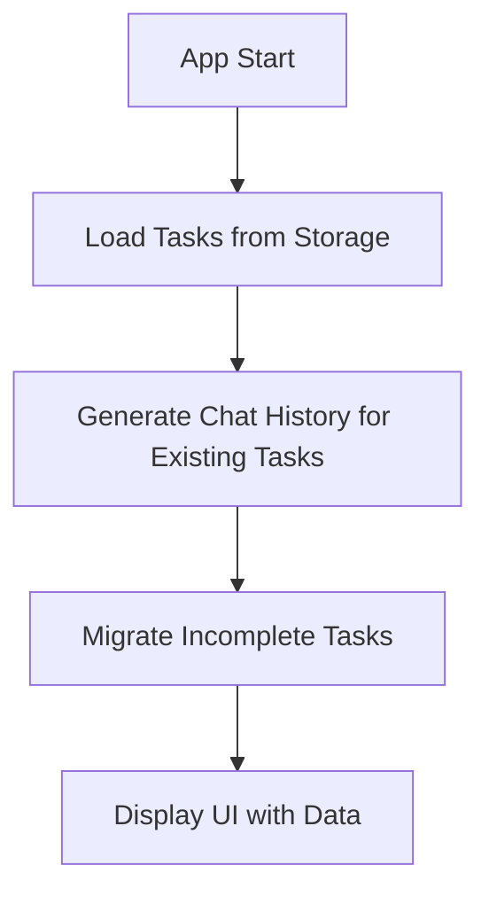
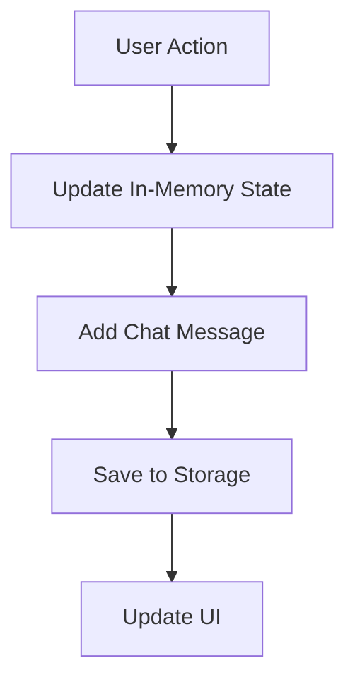

# Storage and Database Architecture Documentation

## Overview

The Ruby task management application uses a **local storage architecture** based on Flutter's `SharedPreferences` package. The app does not use a traditional database but instead implements a JSON-based persistence layer that stores all data locally on the device.

## Architecture Components

### 1. Storage Layer
- **Technology**: `shared_preferences` package (v2.2.2)
- **Storage Type**: Local device storage (key-value pairs)
- **Data Format**: JSON strings serialized/deserialized from Dart objects
- **Scope**: Device-specific, not synchronized across devices

### 2. Data Models

#### Task Model (`lib/core/models/task.dart`)
```dart
class Task {
  final String id;                    // Unique identifier
  final String text;                  // Task content
  final DateTime createdAt;           // Creation timestamp
  final bool isCompleted;             // Completion status
  final DateTime? completedAt;        // Completion timestamp
  final String dayOfWeek;             // Associated day (date key)
  final bool isMigrated;              // Migration status
  final String? originalDayOfWeek;    // Original day before migration
  final bool isDeleted;               // Soft delete flag
  final DateTime? deletedAt;          // Deletion timestamp
}
```

#### ChatMessage Model (`lib/core/models/chat_message.dart`)
```dart
class ChatMessage {
  final String id;                    // Unique identifier
  final ChatMessageType type;         // Message type (taskCreated, etc.)
  final String content;               // Message content (Arabic)
  final DateTime timestamp;           // Message timestamp
  final String? taskId;               // Associated task ID
  final String? taskText;             // Task text for context
  final String? fromDay;              // Source day (for migrations)
  final String? toDay;                // Target day (for migrations)
  final Map<String, dynamic>? metadata; // Additional metadata
}
```

### 3. Storage Services

#### StorageService (`lib/core/services/storage_service.dart`)

**Primary Storage Keys:**
- `ruby_tasks`: Stores all tasks organized by date key
- `last_migration_week`: Tracks the last week when task migration occurred

**Key Methods:**
```dart
// Save all tasks to local storage
static Future<void> saveTasks(Map<String, List<Task>> tasks)

// Load all tasks from local storage
static Future<Map<String, List<Task>>> loadTasks()

// Clear all tasks (for testing/reset)
static Future<void> clearTasks()

// Get storage debugging information
static Future<Map<String, dynamic>> getStorageInfo()

// Migration tracking
static Future<void> setLastMigrationWeek(String weekKey)
static Future<String?> getLastMigrationWeekAsync()
```

**Storage Format:**
```json
{
  "2024-01-15": [
    {
      "id": "1705123456789",
      "text": "Complete project documentation",
      "createdAt": "2024-01-15T10:30:00.000Z",
      "isCompleted": false,
      "completedAt": null,
      "dayOfWeek": "2024-01-15",
      "isMigrated": false,
      "originalDayOfWeek": null,
      "isDeleted": false,
      "deletedAt": null
    }
  ]
}
```

#### ChatHistoryService (`lib/core/services/chat_history_service.dart`)

**Storage Key:**
- `ruby_chat_history`: Stores chat message history

**Key Methods:**
```dart
// Add new chat message
static Future<void> addMessage(ChatMessage message)

// Get chat history for specific day
static Future<List<ChatMessage>> getChatHistoryForDay(String dayKey)

// Get all chat history
static Future<List<ChatMessage>> getAllChatHistory()

// Clear all chat history
static Future<void> clearChatHistory()

// Generate history for existing tasks (app updates)
static Future<void> generateHistoryForExistingTasks(Map<String, List<dynamic>> tasks)
```

**Message Types:**
- `taskCreated`: When a new task is created
- `taskCompleted`: When a task is marked complete
- `taskUncompleted`: When a completed task is unmarked
- `taskDeleted`: When a task is deleted (soft delete)
- `taskMigrated`: When a task is moved between days
- `taskRestored`: When a deleted task is restored
- `daySummary`: Daily completion summary
- `weekSummary`: Weekly completion summary

## Data Flow Architecture

### 1. Application Initialization


### 2. Task Operations Flow


### 3. Storage Operations

#### Saving Tasks
1. **Trigger**: After any task modification (create, update, delete, migrate)
2. **Process**: 
   - Convert `Map<String, List<Task>>` to JSON
   - Serialize using `jsonEncode()`
   - Store as string in SharedPreferences
3. **Location**: Called from `_saveTasks()` method in UI controllers

#### Loading Tasks
1. **Trigger**: App initialization
2. **Process**:
   - Retrieve JSON string from SharedPreferences
   - Parse using `jsonDecode()`
   - Convert back to `Task` objects using `Task.fromJson()`
3. **Location**: Called from `_loadTasks()` method in UI controllers

## Data Persistence Strategy

### 1. Soft Deletes
- Tasks are never permanently removed
- Deleted tasks are marked with `isDeleted: true` and `deletedAt` timestamp
- Allows for task restoration functionality

### 2. Task Migration System
- Incomplete tasks from previous week are automatically migrated to current Saturday
- Migration tracking prevents duplicate migrations
- Uses `isMigrated` flag and `originalDayOfWeek` to track migration history

### 3. Chat History Integration
- Every task operation generates a corresponding chat message
- Chat history provides audit trail and user feedback
- Messages are stored separately from tasks for performance

## Storage Locations by Platform

### Android
- **Path**: `/data/data/com.example.ruby/shared_prefs/`
- **Format**: XML files managed by Android SharedPreferences

### iOS
- **Path**: `~/Library/Preferences/` (app sandbox)
- **Format**: Property list files

### Web
- **Storage**: Browser localStorage
- **Format**: JSON strings

### Desktop (Windows/macOS/Linux)
- **Path**: Platform-specific application data directories
- **Format**: JSON files

## Performance Considerations

### 1. Data Size Management
- All tasks are loaded into memory at startup
- JSON serialization/deserialization for every save operation
- No pagination or lazy loading implemented

### 2. Storage Efficiency
- Tasks stored as JSON strings (larger than binary)
- No compression applied
- Duplicate data across tasks (dayOfWeek repeated)

### 3. Scalability Limits
- Current architecture suitable for personal use (hundreds of tasks)
- May face performance issues with thousands of tasks
- No database indexing or query optimization

## Error Handling

### 1. Storage Failures
- Try-catch blocks around all storage operations
- Graceful degradation (empty data returned on failure)
- Extensive logging for debugging

### 2. Data Corruption
- JSON parsing errors handled gracefully
- Fallback to empty state on corruption
- No data validation or backup mechanisms

### 3. Migration Errors
- Migration operations are idempotent
- Week tracking prevents duplicate migrations
- Fallback to current state on migration failure

## Security Considerations

### 1. Data Privacy
- All data stored locally on device
- No cloud synchronization or external transmission
- No encryption applied to stored data

### 2. Data Access
- SharedPreferences accessible only to the app
- No external app access to stored data
- Standard platform security measures apply

## Development and Testing

### 1. Debugging Tools
- `getStorageInfo()` method for debugging storage state
- Extensive console logging throughout storage operations
- Storage size and key information available

### 2. Testing Support
- `clearTasks()` and `clearChatHistory()` for reset functionality
- Ability to inspect raw JSON data
- Mock data generation capabilities

## Future Improvements

### 1. Database Migration
- Consider SQLite for better performance and querying
- Implement proper indexing for task searches
- Add data validation and constraints

### 2. Data Synchronization
- Cloud backup and sync capabilities
- Cross-device task synchronization
- Conflict resolution strategies

### 3. Performance Optimization
- Implement lazy loading for large task lists
- Add data compression
- Optimize JSON serialization

### 4. Data Integrity
- Add data validation on save/load
- Implement backup and restore functionality
- Add data corruption detection and recovery

## Dependencies

```yaml
dependencies:
  shared_preferences: ^2.2.2  # Local storage
```

## File Structure

```
lib/
├── core/
│   ├── models/
│   │   ├── task.dart              # Task data model
│   │   └── chat_message.dart      # Chat message data model
│   └── services/
│       ├── storage_service.dart   # Task storage service
│       └── chat_history_service.dart # Chat history storage
├── data/
│   ├── datasources/               # Empty (not used)
│   └── repositories/              # Empty (not used)
└── presentation/
    └── views/
        └── home.dart              # Main UI with storage integration
```

This architecture provides a simple, reliable local storage solution suitable for a personal task management application, with room for future enhancements as the application scales.


